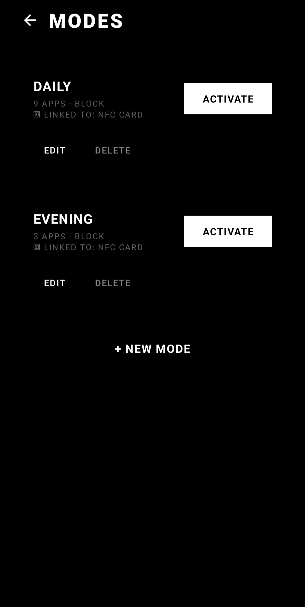
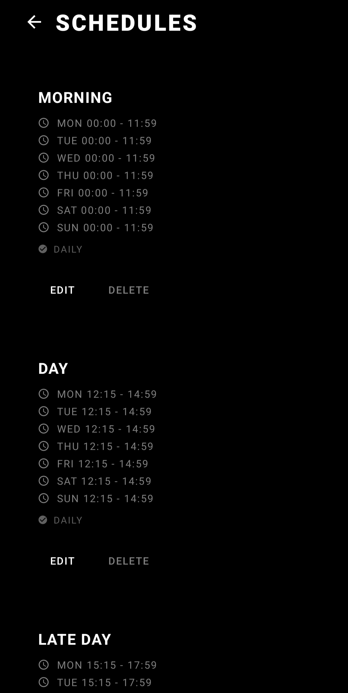
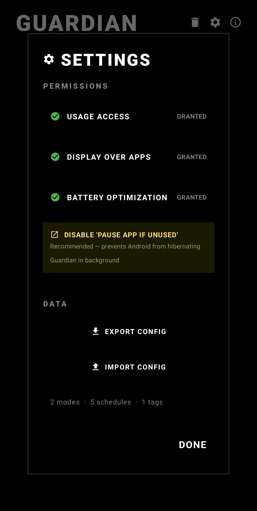
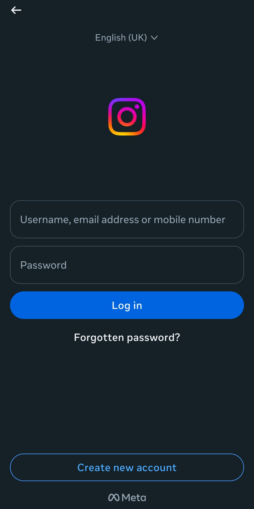
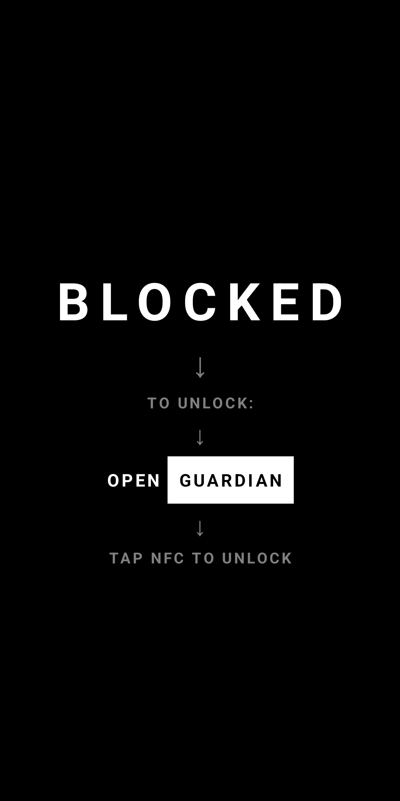

# Guardian

<div align="center">
  
</div>

A minimalist Android app that blocks distracting apps using NFC tags and scheduled modes. Built to add **physical friction** between you and your phone.

## Concept

Guardian forces you to physically interact with an NFC tag to unlock blocked apps. Place your tag somewhere inconvenient — your kitchen, gym bag, a friend's house — and you'll think twice before mindlessly opening Instagram.

**Flow:** Create a mode → select apps to block (or allow) → optionally link an NFC tag → optionally set a schedule → activate → stay focused → tap your NFC tag when you actually need access.

If no NFC tag is linked to a mode, any NFC-capable object (smartwatch, headphones, transit card) can deactivate it.

## Screenshots

### Main Screens

<p align="center">
  
  
  
</p>

<p align="center">
  
  
</p>

### Overlay in Action

<p align="center">
  
  
</p>

## Features

### Modes

Two blocking strategies:

- **Block Selected** — block specific distracting apps while everything else remains accessible
- **Allow Only** — block everything except a whitelist of essential apps

Each mode can optionally require a _specific_ NFC tag for deactivation, preventing you from using just any tag to cheat.

### Schedules

Automate mode activation with flexible scheduling:

- Per-day time configuration (different start/end times for each day of the week)
- Optional automatic deactivation at end time
- Multiple modes can be linked to a single schedule
- Visual status badges: **ACTIVE** when a schedule is running, **DEACTIVATED** when dismissed early via NFC

### NFC Integration

- Register physical NFC tags by tapping them to your device
- Tap a registered tag to deactivate active modes
- Modes with a linked tag _require_ that specific tag — other tags won't work
- Wrong-tag feedback when an incorrect tag is scanned

### Settings & Permissions

Accessible via the gear icon on the home screen:

- **Permission status** — see which permissions are granted, tap to open the relevant system settings
- **Export/Import** — back up your entire configuration (modes, schedules, NFC tags) in JSON or YAML format
  - **Export** to share configs between devices or keep a backup
  - **Import** with two strategies: **Replace** (overwrite everything) or **Merge** (add non-duplicate items)
- **Pause App reminder** — quick link to disable Android's "Pause app if unused" setting

### Emergency Reset

If you lose your NFC tag:

1. Tap the delete icon on the home screen
2. Complete the safety flow (60-second cooldown + confirmation text)
3. Select which tags you lost
4. All modes are deactivated and selected tags are removed — your configurations stay intact

## Technical Details

### Requirements

- Android 8.0+ (API 26)
- NFC hardware (for NFC unlock features)
- Permissions:
  - **Usage Access** — detect which app is in the foreground
  - **Display Over Apps** — show the block overlay
  - **Battery Optimization exemption** — ensure reliable background operation
  - **Disable "Pause app if unused"** — prevent Android from hibernating Guardian

### Architecture

- **Kotlin** with **Jetpack Compose** for a fully declarative UI
- **Foreground Service** pattern for persistent app blocking across reboots and task kills
- **AlarmManager** with exact alarms for precise schedule execution
- **SharedPreferences** for lightweight state persistence
- **kotlinx.serialization** for JSON state management and config export
- **BroadcastReceivers** for boot, package update, and alarm events

### How Blocking Works

Guardian runs a foreground service that polls the current foreground app via `UsageStatsManager`. When a blocked app is detected, a full-screen overlay is displayed, preventing interaction until the user switches away or unlocks with an NFC tag.

## Installation

Go to the [Releases](https://github.com/Andebugulin/nfcGuard/releases/) page and download the latest APK. Install it on your device, grant the necessary permissions, and configure your modes and schedules.

## Manual Installation

1. Clone the repository
2. Open in Android Studio
3. Build and run on a physical device (emulator NFC support is limited)

## Configuration for Custom ROMs

Some manufacturers (Xiaomi, Samsung, Huawei) aggressively kill background services. After installation:

1. **Settings → Apps → Guardian** — disable "Pause app activity if unused"
2. Enable **Autostart** if available (MIUI, ColorOS)
3. Set battery optimization to **Unrestricted** / **No restrictions**
4. On MIUI: add Guardian to the **Lock screen cleanup whitelist**

## Export Format Examples

### JSON

```json
{
  "version": 1,
  "modes": [
    {
      "id": "abc-123",
      "name": "Work Focus",
      "blockedApps": ["com.instagram.android", "com.twitter.android"],
      "blockMode": "BLOCK_SELECTED",
      "nfcTagId": null
    }
  ],
  "schedules": [],
  "nfcTags": []
}
```

### YAML

```yaml
# Guardian Configuration Export
version: 1

modes:
  - id: "abc-123"
    name: "Work Focus"
    blockMode: BLOCK_SELECTED
    nfcTagId: null
    blockedApps:
      - "com.instagram.android"
      - "com.twitter.android"

schedules: []
nfcTags: []
```

# My personal configuration

<details>
  <summary>Click to view my personal configuration</summary>

```yaml
{
  "version": 1,
  "modes":
    [
      {
        "id": "2fc26ed7-25a2-4696-9d57-c6f0fec210cd",
        "name": "Daily",
        "blockedApps":
          [
            "co.hinge.app",
            "com.reddit.frontpage",
            "com.spotify.music",
            "com.zhiliaoapp.musically",
            "com.google.android.apps.youtube.music",
            "app.revanced.android.apps.youtube.music",
            "com.yandex.browser",
            "app.revanced.android.youtube",
            "com.instagram.android",
          ],
        "blockMode": "BLOCK_SELECTED",
        "nfcTagId": "0463b1f1220289",
      },
      {
        "id": "e3a2e7c8-55eb-4d59-8cbf-2ada6dc0ff05",
        "name": "evening",
        "blockedApps":
          [
            "co.hinge.app",
            "app.revanced.android.youtube",
            "com.yandex.browser",
          ],
        "blockMode": "BLOCK_SELECTED",
        "nfcTagId": "0463b1f1220289",
      },
    ],
  "schedules":
    [
      {
        "id": "fd1c04cb-b43e-4f43-961a-313fb5db773f",
        "name": "morning",
        "timeSlot":
          {
            "dayTimes":
              [
                {
                  "day": 1,
                  "startHour": 0,
                  "startMinute": 0,
                  "endHour": 11,
                  "endMinute": 59,
                },
                {
                  "day": 2,
                  "startHour": 0,
                  "startMinute": 0,
                  "endHour": 11,
                  "endMinute": 59,
                },
                {
                  "day": 3,
                  "startHour": 0,
                  "startMinute": 0,
                  "endHour": 11,
                  "endMinute": 59,
                },
                {
                  "day": 4,
                  "startHour": 0,
                  "startMinute": 0,
                  "endHour": 11,
                  "endMinute": 59,
                },
                {
                  "day": 5,
                  "startHour": 0,
                  "startMinute": 0,
                  "endHour": 11,
                  "endMinute": 59,
                },
                {
                  "day": 6,
                  "startHour": 0,
                  "startMinute": 0,
                  "endHour": 11,
                  "endMinute": 59,
                },
                {
                  "day": 7,
                  "startHour": 0,
                  "startMinute": 0,
                  "endHour": 11,
                  "endMinute": 59,
                },
              ],
          },
        "linkedModeIds": ["2fc26ed7-25a2-4696-9d57-c6f0fec210cd"],
        "hasEndTime": true,
      },
      {
        "id": "2e4c179e-bbff-4ba6-8634-3980187f9788",
        "name": "day ",
        "timeSlot":
          {
            "dayTimes":
              [
                {
                  "day": 1,
                  "startHour": 12,
                  "startMinute": 15,
                  "endHour": 14,
                  "endMinute": 59,
                },
                {
                  "day": 2,
                  "startHour": 12,
                  "startMinute": 15,
                  "endHour": 14,
                  "endMinute": 59,
                },
                {
                  "day": 3,
                  "startHour": 12,
                  "startMinute": 15,
                  "endHour": 14,
                  "endMinute": 59,
                },
                {
                  "day": 4,
                  "startHour": 12,
                  "startMinute": 15,
                  "endHour": 14,
                  "endMinute": 59,
                },
                {
                  "day": 5,
                  "startHour": 12,
                  "startMinute": 15,
                  "endHour": 14,
                  "endMinute": 59,
                },
                {
                  "day": 6,
                  "startHour": 12,
                  "startMinute": 15,
                  "endHour": 14,
                  "endMinute": 59,
                },
                {
                  "day": 7,
                  "startHour": 12,
                  "startMinute": 15,
                  "endHour": 14,
                  "endMinute": 59,
                },
              ],
          },
        "linkedModeIds": ["2fc26ed7-25a2-4696-9d57-c6f0fec210cd"],
        "hasEndTime": true,
      },
      {
        "id": "9b0ff839-eaba-4aa5-a55f-a1873deb6a26",
        "name": "late day",
        "timeSlot":
          {
            "dayTimes":
              [
                {
                  "day": 1,
                  "startHour": 15,
                  "startMinute": 15,
                  "endHour": 17,
                  "endMinute": 59,
                },
                {
                  "day": 2,
                  "startHour": 15,
                  "startMinute": 15,
                  "endHour": 17,
                  "endMinute": 59,
                },
                {
                  "day": 3,
                  "startHour": 15,
                  "startMinute": 15,
                  "endHour": 17,
                  "endMinute": 59,
                },
                {
                  "day": 4,
                  "startHour": 15,
                  "startMinute": 15,
                  "endHour": 17,
                  "endMinute": 59,
                },
                {
                  "day": 5,
                  "startHour": 15,
                  "startMinute": 15,
                  "endHour": 17,
                  "endMinute": 59,
                },
                {
                  "day": 6,
                  "startHour": 15,
                  "startMinute": 15,
                  "endHour": 17,
                  "endMinute": 59,
                },
                {
                  "day": 7,
                  "startHour": 15,
                  "startMinute": 15,
                  "endHour": 17,
                  "endMinute": 59,
                },
              ],
          },
        "linkedModeIds": ["2fc26ed7-25a2-4696-9d57-c6f0fec210cd"],
        "hasEndTime": true,
      },
      {
        "id": "ec2a3b62-8056-404e-9f2c-c5aed210a163",
        "name": "evening",
        "timeSlot":
          {
            "dayTimes":
              [
                {
                  "day": 1,
                  "startHour": 18,
                  "startMinute": 15,
                  "endHour": 20,
                  "endMinute": 59,
                },
                {
                  "day": 2,
                  "startHour": 18,
                  "startMinute": 15,
                  "endHour": 20,
                  "endMinute": 59,
                },
                {
                  "day": 3,
                  "startHour": 18,
                  "startMinute": 15,
                  "endHour": 20,
                  "endMinute": 59,
                },
                {
                  "day": 4,
                  "startHour": 18,
                  "startMinute": 15,
                  "endHour": 20,
                  "endMinute": 59,
                },
                {
                  "day": 5,
                  "startHour": 18,
                  "startMinute": 15,
                  "endHour": 20,
                  "endMinute": 59,
                },
                {
                  "day": 6,
                  "startHour": 18,
                  "startMinute": 15,
                  "endHour": 20,
                  "endMinute": 59,
                },
                {
                  "day": 7,
                  "startHour": 18,
                  "startMinute": 15,
                  "endHour": 20,
                  "endMinute": 59,
                },
              ],
          },
        "linkedModeIds": ["e3a2e7c8-55eb-4d59-8cbf-2ada6dc0ff05"],
        "hasEndTime": true,
      },
      {
        "id": "b7bf3650-a6c9-4cbd-92ca-f9dd77128099",
        "name": "night",
        "timeSlot":
          {
            "dayTimes":
              [
                {
                  "day": 1,
                  "startHour": 21,
                  "startMinute": 15,
                  "endHour": 23,
                  "endMinute": 59,
                },
                {
                  "day": 2,
                  "startHour": 21,
                  "startMinute": 15,
                  "endHour": 23,
                  "endMinute": 59,
                },
                {
                  "day": 3,
                  "startHour": 21,
                  "startMinute": 15,
                  "endHour": 23,
                  "endMinute": 59,
                },
                {
                  "day": 4,
                  "startHour": 21,
                  "startMinute": 15,
                  "endHour": 23,
                  "endMinute": 59,
                },
                {
                  "day": 5,
                  "startHour": 21,
                  "startMinute": 15,
                  "endHour": 23,
                  "endMinute": 59,
                },
                {
                  "day": 6,
                  "startHour": 21,
                  "startMinute": 15,
                  "endHour": 23,
                  "endMinute": 59,
                },
                {
                  "day": 7,
                  "startHour": 21,
                  "startMinute": 15,
                  "endHour": 23,
                  "endMinute": 59,
                },
              ],
          },
        "linkedModeIds": ["e3a2e7c8-55eb-4d59-8cbf-2ada6dc0ff05"],
        "hasEndTime": false,
      },
    ],
  "nfcTags":
    [{ "id": "0463b1f1220289", "name": "NFC card", "linkedModeIds": [] }],
}
```

</details>

## License

MIT License

## Contributing

Contributions are welcome. Open an issue or submit a pull request.

## Acknowledgments

Claude AI was used during the development of this project for writing code and UI design.
