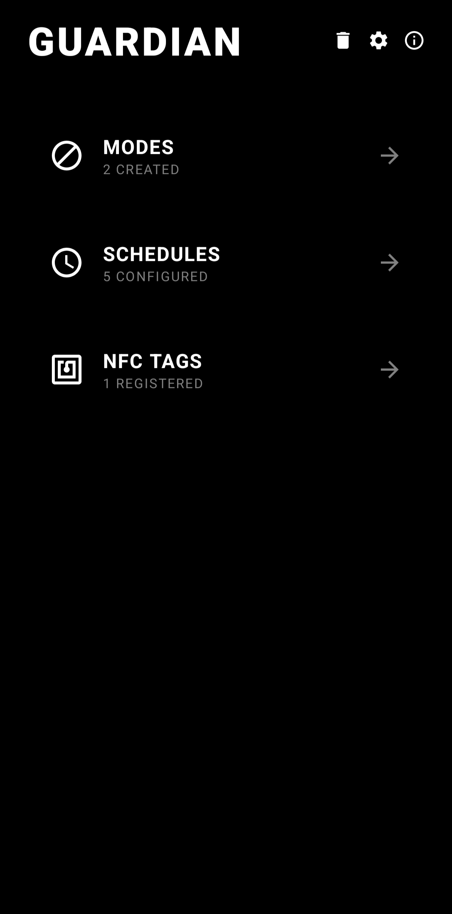
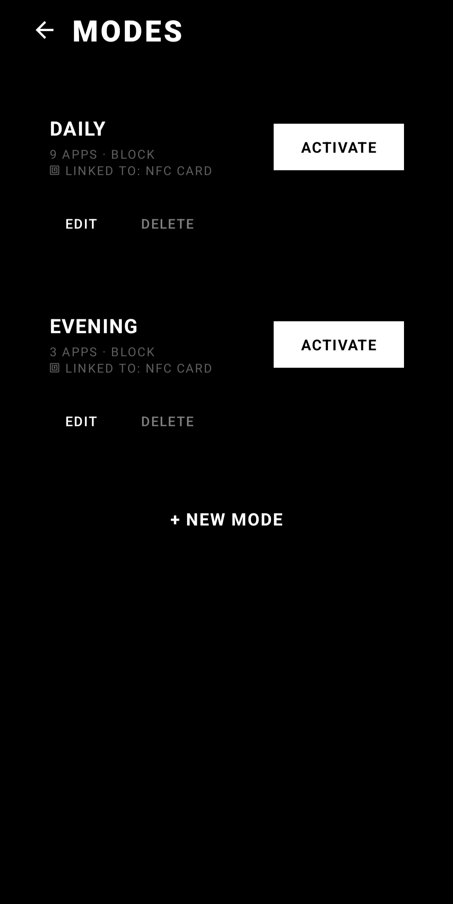
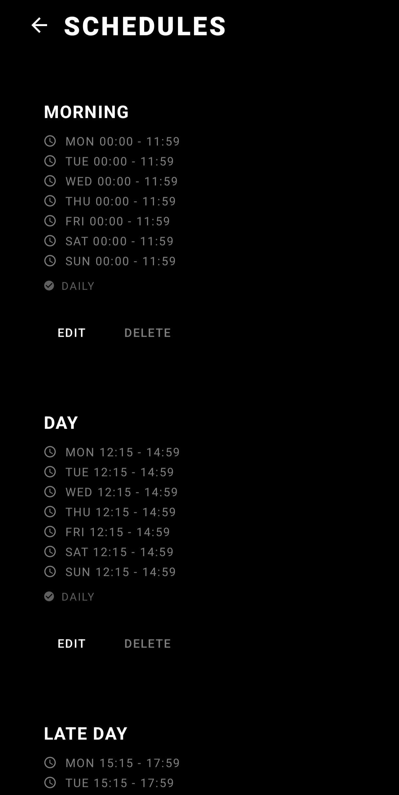
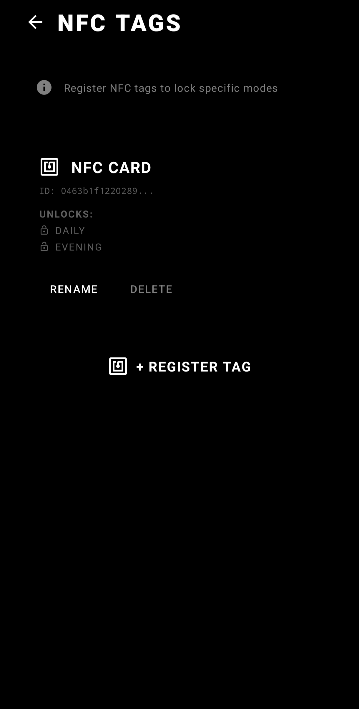
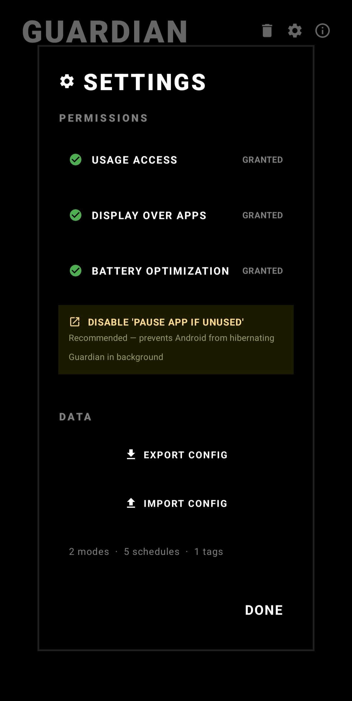
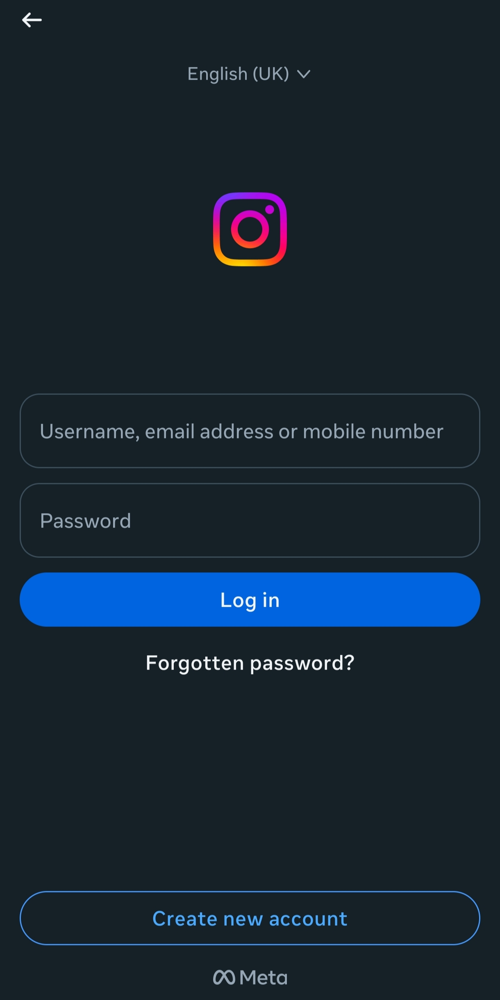
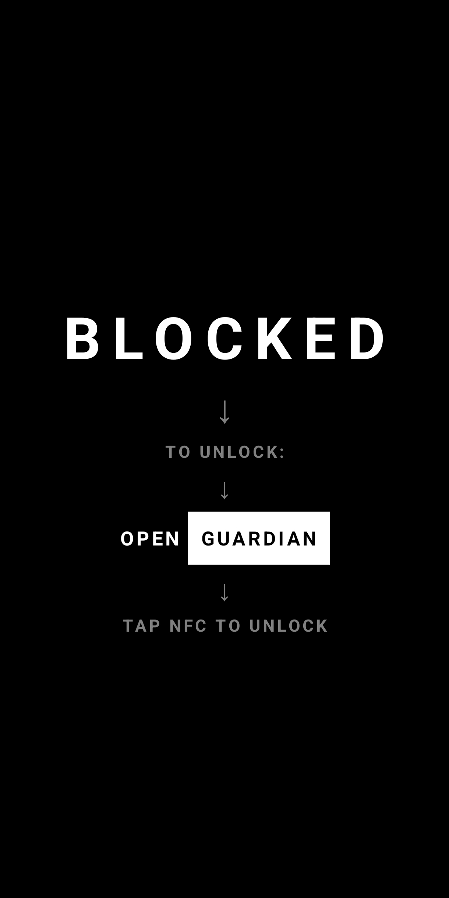

# nfcGuard

<div align="center">
  
</div>

A minimalist Android app that blocks distracting apps using NFC tags and scheduled modes. Built to add **physical friction** between you and your phone.

<p align="center">
  <a href="https://play.google.com/store/apps/details?id=com.andebugulin.nfcguard">Google Play</a> ·
  <a href="https://github.com/Andebugulin/nfcGuard/releases/">Releases</a> ·
  <a href="https://andebugulin.github.io/nfcGuard/">Website</a>
</p>

## Concept

nfcGuard forces you to physically interact with an NFC tag to unlock blocked apps. Place your tag somewhere inconvenient — your kitchen, gym bag, a friend's house — and you'll think twice before mindlessly opening Instagram.

**Flow:** Create a mode → select apps to block (or allow) → optionally link NFC tags → optionally set a schedule → activate → stay focused → tap your NFC tag when you actually need access.

If no NFC tag is linked to a mode, any NFC-capable object (smartwatch, headphones, transit card) can deactivate it.

## Screenshots

### Main Screens

<p align="center">
  
  
  
</p>

<p align="center">
  
  
</p>

### Overlay in Action

<p align="center">
  
  
</p>

## Features

### Modes

Two blocking strategies:

- **Block Selected** — block specific distracting apps while everything else remains accessible
- **Allow Only** — block everything except a whitelist of essential apps

Each mode can have **multiple NFC tags** linked to it. Each tag can be individually configured:

- **Permanent unlock** — tapping the tag fully deactivates the mode until the next scheduled activation
- **Temporary unlock** — tapping the tag unlocks for a configurable duration (e.g. 5 minutes), after which the mode automatically reactivates

This lets you set up different levels of access. For example, keep one tag at home for full unlock and another at work that only gives you 5 minutes — enough to quickly check something without falling down a scroll hole.

### Schedules

Automate mode activation with flexible scheduling:

- Per-day time configuration (different start/end times for each day of the week)
- Optional automatic deactivation at end time
- Multiple modes can be linked to a single schedule
- Visual status badges: **ACTIVE** when a schedule is running, **DEACTIVATED** when dismissed early via NFC

### NFC Integration

- Register physical NFC tags by tapping them to your device
- Link **multiple tags** to a single mode, each with its own unlock behavior
- Configure per-tag unlock duration (permanent or temporary with a time limit)
- Modes with linked tags _require_ one of those specific tags — other tags won't work
- Wrong-tag feedback when an incorrect tag is scanned

### Settings & Permissions

Accessible via the gear icon on the home screen:

- **Permission status** — see which permissions are granted, tap to open the relevant system settings
- **Export/Import** — back up your entire configuration (modes, schedules, NFC tags) in JSON or YAML format
  - **Export** to share configs between devices or keep a backup
  - **Import** with two strategies: **Replace** (overwrite everything) or **Merge** (add non-duplicate items)
- **Pause App reminder** — quick link to disable Android's "Pause app if unused" setting

### Emergency Reset

If you lose your NFC tag:

1. Tap the delete icon on the home screen
2. Complete the safety flow (90-second cooldown + confirmation text)
3. Select which tags you lost
4. All modes are deactivated and selected tags are removed — your configurations stay intact

## Technical Details

### Requirements

- Android 8.0+ (API 26)
- NFC hardware (for NFC unlock features)
- Permissions:
  - **Usage Access** — detect which app is in the foreground
  - **Display Over Apps** — show the block overlay
  - **Battery Optimization exemption** — ensure reliable background operation
  - **Disable "Pause app if unused"** — prevent Android from hibernating nfcGuard

### Architecture

Kotlin + Jetpack Compose, organized as two Gradle modules with strict layering:

```
:domain   Pure Kotlin (no Android imports — compiler-enforced).
          AppState + the four logic objects: NfcUnlockLogic,
          ScheduleTransitions, ModeActivationLogic, BlockDecider.
          78 unit tests run as plain JVM, no emulator needed.

:app      Everything else. Sub-packaged by layer:
          ui/  data/  service/  receiver/  sync/  widget/
```

Inside `:app`, the layers flow in one direction — **Domain → Data → Side effects → Service / UI** — with one owner per concern:

- **`AppStateRepository`** is the single owner of persisted state (`guardian_prefs:app_state`). Every mutation goes through `suspend update(transform: (AppState) -> AppState)`, mutex-guarded. Exactly one file in the codebase references that storage key.
- **`StateSyncer`** is the single dispatcher for platform side effects. The repo auto-invokes it on every successful write, and it does the right thing: restart `BlockerService` with the new params (or stop it entirely if nothing's left to do), reschedule schedule alarms, diff per-mode timed alarms, refresh widgets. There are exactly two `BlockerService.start(...)` callsites and both are inside `StateSyncer`.
- **`GuardianViewModel`** is a thin orchestrator over the domain. Mutating methods are 4-6 lines each — pattern-match on a sealed result from a domain logic object, then call `mutate { … }` which goes through the repo.
- **`BlockerService`** is a lifecycle host over three collaborators: `ForegroundAppDetector` (dual-source detection), `BlockDecider` (pure decision), and an `Enforcer` interface with two implementations (`OverlayEnforcer` and `ForceCloseEnforcer`).

Persistence is `kotlinx.serialization` over `SharedPreferences`. Scheduling is `AlarmManager` with `setExactAndAllowWhileIdle`. Alarms, boot, and service restarts are handled by thin `BroadcastReceiver` adapters that read `repo.current` and call `StateSyncer.sync(context, state)`.

### How Blocking Works

A foreground service (`BlockerService`) polls the current foreground app every ~500ms and uses one of two strategies to block, picked per tick based on whether the Accessibility Service permission is granted:

- **Overlay strategy** (accessibility off): a full-screen `SYSTEM_ALERT_WINDOW` is drawn over the blocked app. The user can tap a `GUARDIAN` button to open the app, or scan an NFC tag to unlock.
- **Force-close strategy** (accessibility on): the user is sent to HOME via the Accessibility Service (bypasses MIUI's background-activity-start restrictions), the blocked app's background processes are killed, and a brief toast is shown. A 3-second cooldown prevents spamming HOME while accessibility events catch up.

Foreground-app detection is dual-source for reliability: the Accessibility Service event timeline (primary, required on Pixel and some Samsung devices where `UsageStatsManager` misreports recents→app transitions), with `UsageStatsManager.queryEvents` and `queryUsageStats` as fallbacks.

Whether the overlay strategy or force-close strategy is right for a given device depends on quirks — overlay races badly with the Accessibility Service on Samsung; force-close needs the Accessibility Service for the HOME action to be reliable on MIUI. The runtime selection per tick covers both.

## Installation

**Google Play:** [Download from Play Store](https://play.google.com/store/apps/details?id=com.andebugulin.nfcguard)

**APK:** Go to the [Releases](https://github.com/Andebugulin/nfcGuard/releases/) page and download the latest APK. Install it on your device, grant the necessary permissions, and configure your modes and schedules.

## Manual Installation

1. Clone the repository
2. Open in Android Studio, or build from the command line:
   ```bash
   ./gradlew :app:assembleDebug         # debug APK → app/build/outputs/apk/debug/
   ./gradlew :app:installDebug          # install on attached device
   ./gradlew :domain:test               # pure-JVM unit tests (fast, no Android SDK)
   ./gradlew test                       # both modules
   ```
3. Run on a physical device — NFC requires real hardware; emulator support is unusable.

## Configuration for Custom ROMs

Some manufacturers (Xiaomi, Samsung, Huawei) aggressively kill background services. After installation:

1. **Settings → Apps → nfcGuard** — disable "Pause app activity if unused"
2. Enable **Autostart** if available (MIUI, ColorOS)
3. Set battery optimization to **Unrestricted** / **No restrictions**
4. On MIUI: add nfcGuard to the **Lock screen cleanup whitelist**

## Export Format Examples

### JSON

```json
{
  "version": 1,
  "modes": [
    {
      "id": "abc-123",
      "name": "Work Focus",
      "blockedApps": ["com.instagram.android", "com.twitter.android"],
      "blockMode": "BLOCK_SELECTED",
      "nfcTagIds": ["tag-001", "tag-002"]
    }
  ],
  "schedules": [],
  "nfcTags": [
    {
      "id": "tag-001",
      "name": "Home tag",
      "unlockDurationMinutes": null
    },
    {
      "id": "tag-002",
      "name": "Work tag",
      "unlockDurationMinutes": 5
    }
  ]
}
```

### YAML

```yaml
# nfcGuard Configuration Export
version: 1

modes:
  - id: "abc-123"
    name: "Work Focus"
    blockMode: BLOCK_SELECTED
    nfcTagIds:
      - "tag-001"
      - "tag-002"
    blockedApps:
      - "com.instagram.android"
      - "com.twitter.android"

schedules: []

nfcTags:
  - id: "tag-001"
    name: "Home tag"
    unlockDurationMinutes: null # permanent unlock
  - id: "tag-002"
    name: "Work tag"
    unlockDurationMinutes: 5 # temporary 5-minute unlock
```

## My personal configuration

<details>
  <summary>Click to view my personal configuration</summary>

```yaml
{
  "version": 1,
  "modes":
    [
      {
        "id": "2fc26ed7-25a2-4696-9d57-c6f0fec210cd",
        "name": "Daily",
        "blockedApps":
          [
            "co.hinge.app",
            "com.reddit.frontpage",
            "com.spotify.music",
            "com.zhiliaoapp.musically",
            "com.google.android.apps.youtube.music",
            "app.revanced.android.apps.youtube.music",
            "com.yandex.browser",
            "app.revanced.android.youtube",
            "com.instagram.android",
          ],
        "blockMode": "BLOCK_SELECTED",
        "nfcTagId": "0463b1f1220289",
      },
      {
        "id": "e3a2e7c8-55eb-4d59-8cbf-2ada6dc0ff05",
        "name": "evening",
        "blockedApps":
          [
            "co.hinge.app",
            "app.revanced.android.youtube",
            "com.yandex.browser",
          ],
        "blockMode": "BLOCK_SELECTED",
        "nfcTagId": "0463b1f1220289",
      },
    ],
  "schedules":
    [
      {
        "id": "fd1c04cb-b43e-4f43-961a-313fb5db773f",
        "name": "morning",
        "timeSlot":
          {
            "dayTimes":
              [
                {
                  "day": 1,
                  "startHour": 0,
                  "startMinute": 0,
                  "endHour": 11,
                  "endMinute": 59,
                },
                {
                  "day": 2,
                  "startHour": 0,
                  "startMinute": 0,
                  "endHour": 11,
                  "endMinute": 59,
                },
                {
                  "day": 3,
                  "startHour": 0,
                  "startMinute": 0,
                  "endHour": 11,
                  "endMinute": 59,
                },
                {
                  "day": 4,
                  "startHour": 0,
                  "startMinute": 0,
                  "endHour": 11,
                  "endMinute": 59,
                },
                {
                  "day": 5,
                  "startHour": 0,
                  "startMinute": 0,
                  "endHour": 11,
                  "endMinute": 59,
                },
                {
                  "day": 6,
                  "startHour": 0,
                  "startMinute": 0,
                  "endHour": 11,
                  "endMinute": 59,
                },
                {
                  "day": 7,
                  "startHour": 0,
                  "startMinute": 0,
                  "endHour": 11,
                  "endMinute": 59,
                },
              ],
          },
        "linkedModeIds": ["2fc26ed7-25a2-4696-9d57-c6f0fec210cd"],
        "hasEndTime": true,
      },
      {
        "id": "2e4c179e-bbff-4ba6-8634-3980187f9788",
        "name": "day ",
        "timeSlot":
          {
            "dayTimes":
              [
                {
                  "day": 1,
                  "startHour": 12,
                  "startMinute": 15,
                  "endHour": 14,
                  "endMinute": 59,
                },
                {
                  "day": 2,
                  "startHour": 12,
                  "startMinute": 15,
                  "endHour": 14,
                  "endMinute": 59,
                },
                {
                  "day": 3,
                  "startHour": 12,
                  "startMinute": 15,
                  "endHour": 14,
                  "endMinute": 59,
                },
                {
                  "day": 4,
                  "startHour": 12,
                  "startMinute": 15,
                  "endHour": 14,
                  "endMinute": 59,
                },
                {
                  "day": 5,
                  "startHour": 12,
                  "startMinute": 15,
                  "endHour": 14,
                  "endMinute": 59,
                },
                {
                  "day": 6,
                  "startHour": 12,
                  "startMinute": 15,
                  "endHour": 14,
                  "endMinute": 59,
                },
                {
                  "day": 7,
                  "startHour": 12,
                  "startMinute": 15,
                  "endHour": 14,
                  "endMinute": 59,
                },
              ],
          },
        "linkedModeIds": ["2fc26ed7-25a2-4696-9d57-c6f0fec210cd"],
        "hasEndTime": true,
      },
      {
        "id": "9b0ff839-eaba-4aa5-a55f-a1873deb6a26",
        "name": "late day",
        "timeSlot":
          {
            "dayTimes":
              [
                {
                  "day": 1,
                  "startHour": 15,
                  "startMinute": 15,
                  "endHour": 17,
                  "endMinute": 59,
                },
                {
                  "day": 2,
                  "startHour": 15,
                  "startMinute": 15,
                  "endHour": 17,
                  "endMinute": 59,
                },
                {
                  "day": 3,
                  "startHour": 15,
                  "startMinute": 15,
                  "endHour": 17,
                  "endMinute": 59,
                },
                {
                  "day": 4,
                  "startHour": 15,
                  "startMinute": 15,
                  "endHour": 17,
                  "endMinute": 59,
                },
                {
                  "day": 5,
                  "startHour": 15,
                  "startMinute": 15,
                  "endHour": 17,
                  "endMinute": 59,
                },
                {
                  "day": 6,
                  "startHour": 15,
                  "startMinute": 15,
                  "endHour": 17,
                  "endMinute": 59,
                },
                {
                  "day": 7,
                  "startHour": 15,
                  "startMinute": 15,
                  "endHour": 17,
                  "endMinute": 59,
                },
              ],
          },
        "linkedModeIds": ["2fc26ed7-25a2-4696-9d57-c6f0fec210cd"],
        "hasEndTime": true,
      },
      {
        "id": "ec2a3b62-8056-404e-9f2c-c5aed210a163",
        "name": "evening",
        "timeSlot":
          {
            "dayTimes":
              [
                {
                  "day": 1,
                  "startHour": 18,
                  "startMinute": 15,
                  "endHour": 20,
                  "endMinute": 59,
                },
                {
                  "day": 2,
                  "startHour": 18,
                  "startMinute": 15,
                  "endHour": 20,
                  "endMinute": 59,
                },
                {
                  "day": 3,
                  "startHour": 18,
                  "startMinute": 15,
                  "endHour": 20,
                  "endMinute": 59,
                },
                {
                  "day": 4,
                  "startHour": 18,
                  "startMinute": 15,
                  "endHour": 20,
                  "endMinute": 59,
                },
                {
                  "day": 5,
                  "startHour": 18,
                  "startMinute": 15,
                  "endHour": 20,
                  "endMinute": 59,
                },
                {
                  "day": 6,
                  "startHour": 18,
                  "startMinute": 15,
                  "endHour": 20,
                  "endMinute": 59,
                },
                {
                  "day": 7,
                  "startHour": 18,
                  "startMinute": 15,
                  "endHour": 20,
                  "endMinute": 59,
                },
              ],
          },
        "linkedModeIds": ["e3a2e7c8-55eb-4d59-8cbf-2ada6dc0ff05"],
        "hasEndTime": true,
      },
      {
        "id": "b7bf3650-a6c9-4cbd-92ca-f9dd77128099",
        "name": "night",
        "timeSlot":
          {
            "dayTimes":
              [
                {
                  "day": 1,
                  "startHour": 21,
                  "startMinute": 15,
                  "endHour": 23,
                  "endMinute": 59,
                },
                {
                  "day": 2,
                  "startHour": 21,
                  "startMinute": 15,
                  "endHour": 23,
                  "endMinute": 59,
                },
                {
                  "day": 3,
                  "startHour": 21,
                  "startMinute": 15,
                  "endHour": 23,
                  "endMinute": 59,
                },
                {
                  "day": 4,
                  "startHour": 21,
                  "startMinute": 15,
                  "endHour": 23,
                  "endMinute": 59,
                },
                {
                  "day": 5,
                  "startHour": 21,
                  "startMinute": 15,
                  "endHour": 23,
                  "endMinute": 59,
                },
                {
                  "day": 6,
                  "startHour": 21,
                  "startMinute": 15,
                  "endHour": 23,
                  "endMinute": 59,
                },
                {
                  "day": 7,
                  "startHour": 21,
                  "startMinute": 15,
                  "endHour": 23,
                  "endMinute": 59,
                },
              ],
          },
        "linkedModeIds": ["e3a2e7c8-55eb-4d59-8cbf-2ada6dc0ff05"],
        "hasEndTime": false,
      },
    ],
  "nfcTags":
    [{ "id": "0463b1f1220289", "name": "NFC card", "linkedModeIds": [] }],
}
```

</details>

## License

MIT License

## Contributing

Contributions are welcome. Open an issue or submit a pull request.

## Acknowledgments

Claude AI was used during the development of this project for writing code and UI design.
