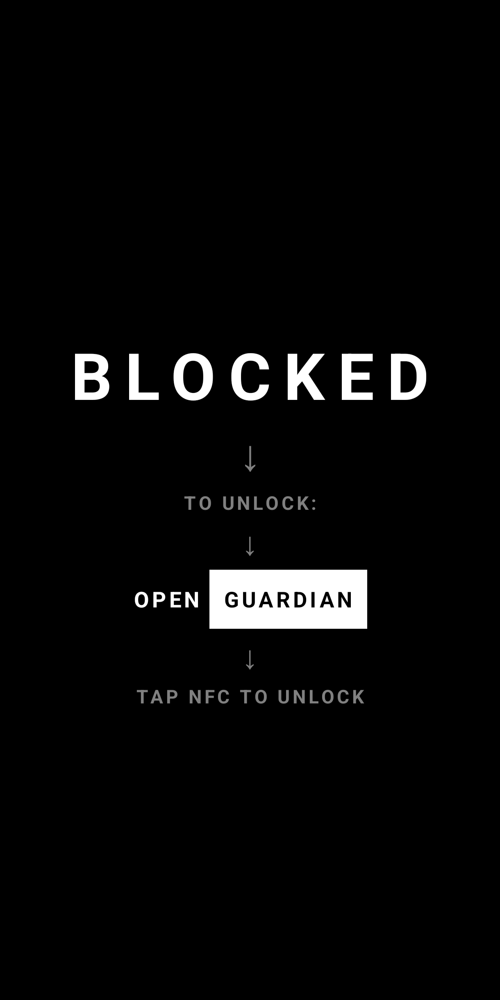
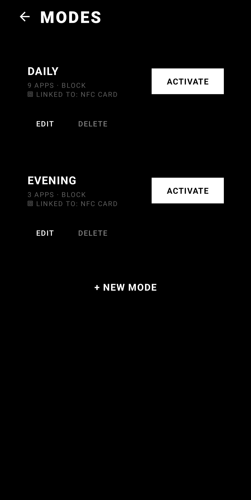
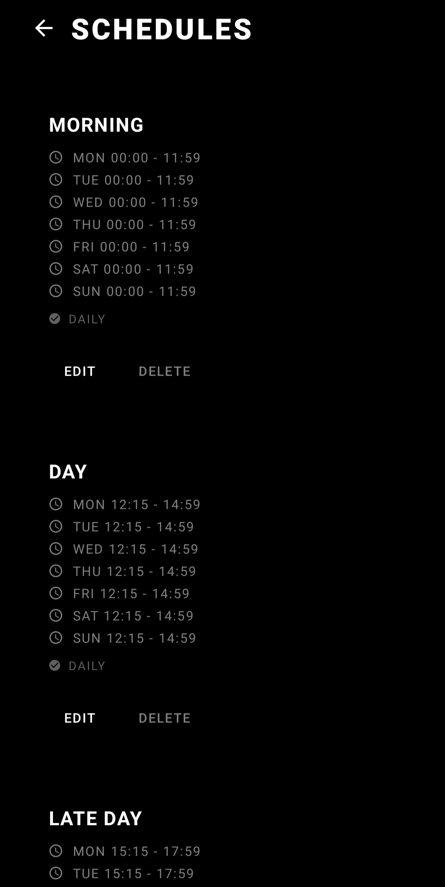
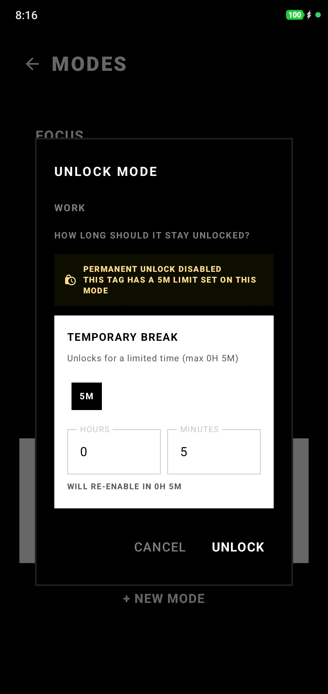
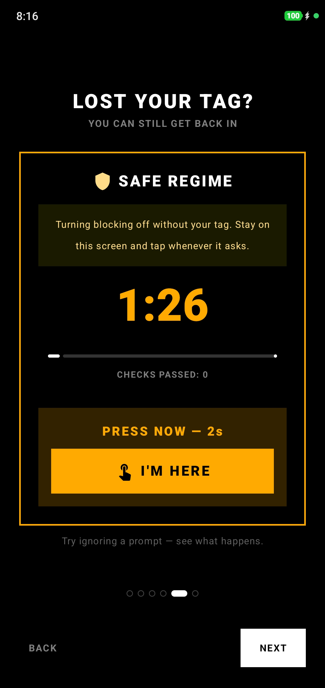
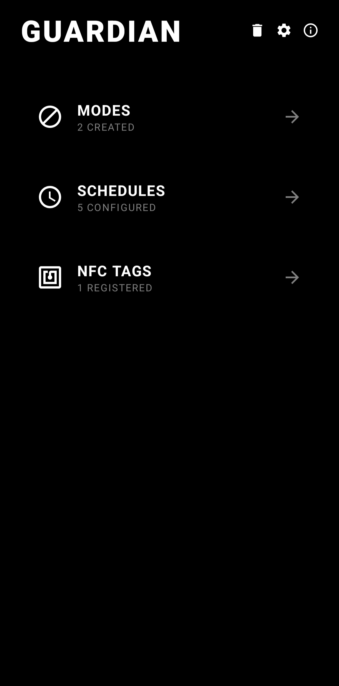

# nfcGuard

<div align="center">
  
  <p><strong>Block distracting apps behind a physical NFC tag.</strong></p>
  <p>
    <a href="https://play.google.com/store/apps/details?id=com.andebugulin.nfcguard">Google Play</a> ·
    <a href="https://github.com/Andebugulin/nfcGuard/releases/">Releases</a> ·
    <a href="https://andebugulin.github.io/nfcGuard/">Website</a>
  </p>
</div>

Keep the tag somewhere inconvenient, like the kitchen or a gym bag, and opening Instagram costs a walk instead of a thumb.

<p align="center">
  
  
  
</p>

## How it works

Create a **mode**, which is a set of apps that are either blocked or allowed. Turn it on by hand, or link a **schedule** so it turns itself on. While a mode is active, those apps will not open. Tap a linked **NFC tag** to unlock.

Each tag decides how much it gives you. One tag can unlock a mode completely. Another can be capped at five minutes, after which the mode comes back on by itself. Keep the generous one at home and the strict one at the office.

A mode with no tag linked accepts any NFC object, such as a transit card or a pair of headphones. A mode with tags linked accepts only those tags.

<p align="center">
  
  
  
</p>

**Lost your tag?** The delete icon on Home starts a recovery flow: a timed attention challenge, then you choose which tags are gone. Modes switch off and those tags are removed. Your configuration stays.

## Requirements

Android 8.0 or newer (API 26), and a phone with NFC.

| Permission | Why |
| --- | --- |
| Usage Access | See which app is in front |
| Display over apps | Draw the block screen |
| Battery | Keep running in the background |
| Accessibility | Required on Pixel and Samsung, faster everywhere else |
| Autostart | On Xiaomi, Oppo, vivo, Huawei and OnePlus, or blocking stops after a reboot |
| Pause app if unused | Turn it off in app settings |

The in-app permissions page links to every one of these and rechecks when you come back.

## Install

From [Google Play](https://play.google.com/store/apps/details?id=com.andebugulin.nfcguard), or grab an APK from [Releases](https://github.com/Andebugulin/nfcGuard/releases/).

## Build

```bash
./gradlew :app:assembleDebug   # APK into app/build/outputs/apk/debug/
./gradlew :app:installDebug    # onto an attached device
./gradlew test                 # 333 unit tests, no emulator
```

NFC needs real hardware. The emulator cannot exercise tag flows.

## Architecture

Two Gradle modules. `:domain` is pure Kotlin: `AppState` plus four logic objects (`NfcUnlockLogic`, `ScheduleTransitions`, `ModeActivationLogic`, `BlockDecider`). It cannot import Android, and the compiler enforces that, so it tests as plain JVM. `:app` holds everything else: Compose UI, services, receivers, widget.

Inside `:app` the layers run one direction, Domain to Data to Side effects to Service and UI, with a single owner for each concern.

* **`AppStateRepository`** owns persisted state. Every mutation goes through a mutex-guarded `update { transform }`, and exactly one file in the repo knows the storage key.
* **`StateSyncer`** owns platform side effects. The repository invokes it after each write, and it restarts `BlockerService`, reschedules alarms, diffs timed unlocks and refreshes widgets. There are exactly two `BlockerService.start(...)` call sites and both live inside it.
* **`BlockerService`** hosts three collaborators: `ForegroundAppDetector`, `BlockDecider`, and an `Enforcer`. The enforcer is an overlay when accessibility is off and a force-close when it is on, chosen per tick.

[CLAUDE.md](CLAUDE.md) has the long version, including the invariants worth not breaking.

## Config

Settings exports modes, schedules and tags as JSON or YAML. Config only, never runtime state. Import either replaces everything or merges by id.

<details>
<summary>Example</summary>

```yaml
version: 1
modes:
  - id: "abc-123"
    name: "Work Focus"
    blockMode: BLOCK_SELECTED
    nfcTagIds: ["tag-001", "tag-002"]
    blockedApps:
      - "com.instagram.android"
      - "com.reddit.frontpage"
schedules: []
nfcTags:
  - id: "tag-001"
    name: "Home tag"
    unlockDurationMinutes: null   # permanent
  - id: "tag-002"
    name: "Work tag"
    unlockDurationMinutes: 5      # five minutes, then back on
```

</details>

## License

MIT. Issues and pull requests welcome.
